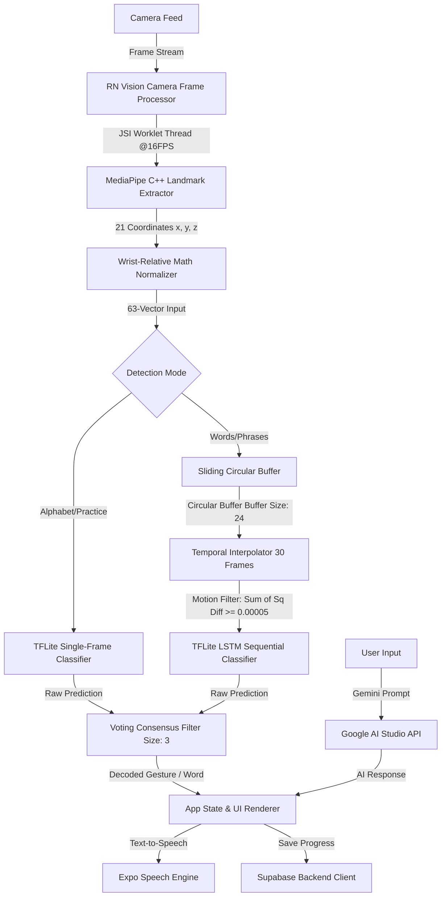

# 🌉 SignBridge: Real-Time AI-Powered American Sign Language (ASL) Recognition

[](https://reactnative.dev)
[](https://expo.dev)
[](https://tensorflow.org)
[](https://supabase.com)
[](https://python.org)
[](https://developers.google.com/mediapipe)

**SignBridge** is a high-performance, cross-platform mobile application designed to bridge the communication gap between the Deaf and hearing communities. The system harnesses local computer vision, on-device deep learning pipelines, and large language models (LLMs) to scan, interpret, and convert real-time American Sign Language (ASL) gestures into conversational text and interactive speech.

---

## 📸 Core Features

- **⚡ High-Frame-Rate On-Device Scanning:** Seamless camera-based hand landmark tracking and gesture classification running at a target **16 FPS** on background threads, keeping the React Native UI running buttery-smooth at **60 FPS**.
- **🤖 Context-Aware AI Chat (Gemini):** An interactive educational chat portal powered by Google Gemini, allowing users to ask conversational questions, practice sign translation, and review signing guides.
- **📊 User Progress & Learning Analytics:** Real-time synchronization of practiced signs, daily streaks, accuracy charts, and feedback forms to track learning curves.
- **🔒 Secure Syncing & Row-Level Security:** Powered by Supabase Auth and PostgreSQL, featuring granular Row-Level Security (RLS) policies protecting user profiles, learning logs, and settings.
- **⚡ Offline-First Hand Normalization:** Local coordinate mathematical normalization that renders predictions invariant to user distance from the camera lens.

---

## 🧠 System Architecture & Data Flow

Below is the technical data flow outlining how frames captured by the camera are processed via custom C++ JSI hooks, translated by deep learning models, and synchronized with our backend services.



---

## 🛠️ Deep Engineering: Technical Highlights & Optimization

This application goes beyond basic ML wrappers. It contains advanced mobile performance optimizations, mathematical normalization, and real-time noise reduction filters:

### 1. Zero-Jank Background Frame Processing (React Native JSI & Worklets)
- **Problem:** Running deep learning models directly on the React Native JavaScript thread blocks layout calculations, dropping UI framerates below 15 FPS.
- **Solution:** We leveraged **React Native JSI (JavaScript Interface)** via [useHandLandmarks.ts](file:///d:/Santos_BSIS/SignBridge/components/useHandLandmarks.ts) and [useTFLiteFrame.ts](file:///d:/Santos_BSIS/SignBridge/components/useTFLiteFrame.ts). The raw camera frames are intercepted by `react-native-vision-camera`, resized using `vision-camera-resize-plugin`, and predicted inside C++ Worklets on a dedicated background thread.
- **Impact:** The main UI thread runs at 60 FPS while real-time inference ticks concurrently at 16 FPS without blocking navigation, animations, or inputs.

### 2. Camera-Distance Invariance (Wrist-Relative Normalization)
- **Problem:** If a user stands close to the camera, raw hand landmark coordinates are large; if they stand far away, coordinates are small. This breaks model accuracy.
- **Solution:** We implemented a local mathematical normalization layer on the 21 extracted hand landmarks (63 values). All coordinates are translated relative to the wrist point (the first landmark coordinate `[wx, wy, wz]`):
  $$\text{Normalized}_i = \text{Landmark}_i - \text{Landmark}_{\text{wrist}}$$
- **Impact:** The classification model only processes relative hand shapes, ensuring robust recognition whether the user is 1 foot or 6 feet away.

### 3. Dynamic Temporal Interpolation & Motion Energy Filter
- **Problem:** Single-frame classification struggles with words (which are temporal gestures rather than static poses). However, users sign at different speeds, creating variable-length landmark lists.
- **Solution:** 
  - **Circular Buffer:** The app tracks landmarks in a circular buffer of size 24.
  - **Temporal Resampling:** The variable frames are mathematically interpolated to a fixed sequence of exactly **30 frames** (totaling $30 \times 63 = 1890$ inputs) before feeding them to the temporal classifier.
  - **Motion Energy Thresholding:** To avoid idle predictions, the system computes the sum of squared differences of coordinates across successive frames. If the cumulative motion energy drops below `0.00005`, the frame sequence is flagged as inactive, saving CPU/GPU cycles.

### 4. Noise-Filtering Consensus Mechanism (Voting Window)
- **Problem:** Real-time ML outputs suffer from "flickering" (e.g., oscillating between 'A' and 'E' inside intermediate frames).
- **Solution:** We implemented a rolling **voting consensus filter** of size 3. A prediction is only dispatched to the UI if it wins the majority vote among the last three sequential classifications.
- **Impact:** Eradicates flickering, resulting in smooth, stable, and readable text outputs.

### 5. Memory-Efficient Python Preprocessing Pipeline
- **Problem:** Splitting raw video files for sign model training usually loads full videos into RAM, causing memory overflows on developer machines.
- **Solution:** In [split_recordings.py](file:///d:/Santos_BSIS/SignBridge/split_recordings.py), we designed a double-pass OpenCV pipeline:
  - **Pass 1:** Analyzes pixel differences frame-by-frame on resized low-resolution matrices (320x240) to locate motion segments.
  - **Pass 2:** Automatically streams and writes the high-resolution frame segments to files, discarding idle sequences.

---

## 🗄️ Database Architecture

We designed a fully-indexed database schema in [DATABASE_SCHEMA.sql](file:///d:/Santos_BSIS/SignBridge/DATABASE_SCHEMA.sql) using Supabase PostgreSQL. Below is the relational structure:

| Table Name | Purpose | Primary Key | Key Relationships / Constraints |
| :--- | :--- | :--- | :--- |
| **`users`** | User profiles extending Supabase Auth | `id` (UUID) | Extends `auth.users(id)` ON DELETE CASCADE |
| **`signs`** | Logs of individual detected hand signs | `id` (UUID) | `user_id` -> `users(id)`, tracks confidence |
| **`sign_history`** | Concat sequences of letters/words | `id` (UUID) | `user_id` -> `users(id)` |
| **`conversations`**| Generative AI chats list | `id` (UUID) | `user_id` -> `users(id)` |
| **`messages`** | Chat messages from user / Gemini AI | `id` (UUID) | `conversation_id` -> `conversations(id)`, `user_id` -> `users(id)` |
| **`learning_progress`**| Learning streaks, accuracy scores | `id` (UUID) | `user_id` -> `users(id)` |
| **`user_settings`** | App preferences (Theme, threshold) | `id` (UUID) | `user_id` -> `users(id)` UNIQUE |
| **`feedback`** | User bugs, feature requests | `id` (UUID) | `user_id` -> `users(id)` ON DELETE SET NULL |

> [!NOTE]
> All tables enforce granular **Row Level Security (RLS)** policies ensuring users can only read, write, or delete their own data. Indexes have been added on all foreign key fields (`user_id`, `conversation_id`) and timestamps for optimal query performance.

---

## 🚀 Setup & Local Development

This project utilizes advanced hardware modules (such as Camera Frame Processors and TFLite native bindings). Therefore, **it must be run on a local development build** instead of the standard Expo Go client.

### Prerequisites
- [Node.js](https://nodejs.org) (v18+ recommended)
- [Android Studio SDK](https://developer.android.com/studio) (for Android compilation) or [Xcode](https://developer.apple.com/xcode/) (for macOS/iOS compilation)
- A [Supabase Project](https://supabase.com) (free tier works perfectly)
- A [Google AI Studio API Key](https://ai.google.dev/) (for Gemini AI functionality)

### 1. Clone & Install Dependencies
```bash
git clone https://github.com/Hitorido/SignBridge-ASL-Recogniton.git
cd SignBridge-ASL-Recogniton
npm install
```

### 2. Configure Environment Variables
Create a `.env` file in the project root:
```env
EXPO_PUBLIC_SUPABASE_URL=https://your-supabase-project.supabase.co
EXPO_PUBLIC_SUPABASE_ANON_KEY=your-supabase-anon-key
EXPO_PUBLIC_GEMINI_API_KEY=your-google-gemini-api-key
```

### 3. Initialize the Database
1. Copy the contents of [DATABASE_SCHEMA.sql](file:///d:/Santos_BSIS/SignBridge/DATABASE_SCHEMA.sql).
2. Go to the SQL Editor in your Supabase dashboard, paste the queries, and click **Run**.

### 4. Build and Launch
Generate native directories (`/android` and `/ios`) and compile the development build:
```bash
# Run Expo Native Prebuild
npx expo prebuild

# Launch on Android Emulator or connected device
npx expo run:android

# Launch on iOS Simulator (macOS required)
npx expo run:ios
```

---

## 📦 Python ML Pipeline Setup
To prepare custom video datasets and split long recordings:
```bash
# Install Python prerequisites
pip install opencv-python numpy

# Configure paths inside split_recordings.py and execute
python split_recordings.py
```

---

## 💡 Tech Stack Breakdown
- **Frontend Framework:** React Native (Expo SDK 54)
- **Routing:** Expo Router (File-based navigation)
- **Styles:** Tailwind CSS via NativeWind v4
- **Camera & Processors:** Expo Camera, Vision Camera, Custom JSI Native Plugins
- **ML Inference:** React Native Fast TFLite, TensorFlow models
- **Database / Backend:** Supabase (Auth, PostgreSQL, Row Level Security)
- **Generative AI:** Google Gemini API
- **Data Splitting & CV Processing:** OpenCV, Python, Numpy
